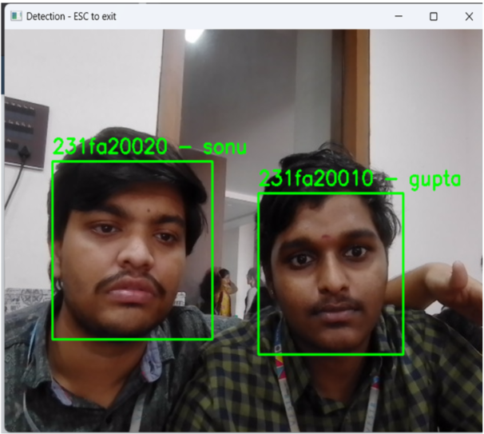

# Smart Portal - Face Recognition Attendance System




## 📋 Project Overview

Smart Portal is an **AI-powered attendance system** that uses real-time face recognition to automatically detect and log student/faculty attendance. The system combines deep learning (Haar Cascades + custom CNN model) with a web-based dashboard for seamless attendance management.

### Key Highlights:
- ✅ **Real-time Face Detection** - Detects multiple faces simultaneously with bounding boxes and labels
- ✅ **Face Recognition** - Trained neural network model for accurate face identification
- ✅ **Automatic Attendance Logging** - Records attendance with timestamp and student/faculty ID
- ✅ **Web Dashboard** - Separate dashboards for students and faculty with attendance reports
- ✅ **CSV Reports** - Exports attendance data for analysis

---

## 🚀 Features

- **Face Detection**: Uses Haar Cascades (`haarcascade_frontalface_default.xml`) for real-time detection
- **Deep Learning Model**: Custom trained CNN model (`face_model.h5`) for face recognition
- **Web Interface**: HTML/CSS/JavaScript dashboards for intuitive user experience
- **Database Integration**: MongoDB backend for storing user profiles and attendance records
- **Multiple User Roles**: Student and Faculty dashboards with role-based access
- **Attendance Reports**: CSV export functionality for attendance analytics

---

## 📁 Project Structure

```
smart-portal/
├── backend/                          # Flask backend server
│   ├── app.py                       # Main Flask application
│   ├── database_setup.py            # MongoDB database initialization
│   ├── test_face_detection.py       # Face detection testing
│   ├── predict_single.py            # Single face prediction
│   ├── haarcascade_frontalface_default.xml  # Haar Cascade classifier
│   └── dataset/                     # Training dataset
│
├── frontend/                         # Web interface
│   ├── index.html                   # Main landing page
│   ├── student_dashboard.html       # Student attendance view
│   ├── faculty_dashboard.html       # Faculty management view
│   ├── css/
│   │   └── style.css                # Styling
│   └── js/
│       └── main.js                  # Frontend logic
│
├── model/                           # ML model components
│   ├── train_model.py              # Model training script
│   ├── predict_face.py             # Face prediction logic
│   ├── face_model.h5               # Trained model weights
│   └── attendance.csv              # Attendance records
│
├── face_recognition/               # Recognition utilities
├── dataset/                         # Training dataset storage
└── docs/                           # Documentation & images

```

---

## 🛠️ Technologies Used

- **Backend**: Python 3.10, Flask
- **Machine Learning**: TensorFlow/Keras, OpenCV, Haar Cascades
- **Frontend**: HTML5, CSS3, JavaScript
- **Database**: MongoDB
- **Model Format**: H5 (Keras)

---

## 📦 Installation & Setup

### Prerequisites
- Python 3.10+
- pip (Python package manager)
- MongoDB (optional, for database features)

### Step 1: Clone the Repository
```bash
git clone https://github.com/shaikmefuz042-code/smart-portal.git
cd smart-portal
```

### Step 2: Create Virtual Environment
```bash
python -m venv venv
# On Windows:
.\venv\Scripts\activate
# On macOS/Linux:
source venv/bin/activate
```

### Step 3: Install Dependencies
```bash
pip install -r requirements.txt
```

### Step 4: Run the Backend Server
```bash
cd backend
python app.py
```
The Flask server will start on `http://localhost:5000`

### Step 5: Access the Application
- Open your browser and navigate to `http://localhost:5000`
- Select **Student Dashboard** or **Faculty Dashboard** from the landing page

---

## ✅ Continuous Integration
This repository now includes a GitHub Actions workflow at `.github/workflows/python-app.yml`.

The CI workflow:
- runs on `push` and `pull_request` to `master`
- sets up Python 3.10
- installs dependencies from `requirements.txt`
- validates Python syntax in `backend/` and `model/`

---

## 🎯 How to Use

### **Student Dashboard**
1. Navigate to the Student Dashboard
2. Stand in front of your camera
3. The system automatically detects your face and logs your attendance
4. View your attendance history

### **Faculty Dashboard**
1. Navigate to the Faculty Dashboard
2. Manage student profiles and attendance records
3. View attendance reports and statistics
4. Export attendance data as CSV

### **Training a New Model** (Optional)
```bash
cd model
python train_model.py
```

### **Testing Face Detection**
```bash
cd backend
python test_face_detection.py
```

---

## 📊 Face Detection Output

The system displays:
- **Green bounding boxes** around detected faces
- **Student ID** and **Name** labels above each face
- **Real-time processing** for multiple simultaneous detections

Example: `231fa20020 - sonu` and `231fa20010 - gupta` (as shown in the demo image)

---

## 📈 Attendance Report

Attendance is automatically saved to `model/attendance.csv` with the following format:
```
Student_ID, Name, Date, Time, Status
231fa20020, sonu, 2024-01-15, 09:30:00, Present
231fa20010, gupta, 2024-01-15, 09:31:00, Present
```

---

## 🔧 Configuration

Key configuration files:
- `.env` - Environment variables (create if needed)
- `requirements.txt` - Python dependencies
- MongoDB connection string in `backend/database_setup.py`

---

## 📝 API Endpoints (Backend)

- `GET /` - Landing page
- `GET /student_dashboard` - Student dashboard
- `GET /faculty_dashboard` - Faculty dashboard
- `POST /detect_face` - Detect face and log attendance
- `GET /attendance_report` - Download attendance CSV

---

## 🐛 Troubleshooting

### Camera not detected?
- Ensure your camera is connected and permissions are granted
- Update OpenCV: `pip install --upgrade opencv-python`

### Face detection not working?
- Ensure proper lighting conditions
- Make sure `haarcascade_frontalface_default.xml` is in the backend folder
- Test with `python test_face_detection.py`

### Model prediction errors?
- Verify `face_model.h5` exists in the model folder
- Retrain the model if accuracy is low: `python model/train_model.py`

---

## 📚 Project Demo

The image above shows the face detection system in action:
- Multiple faces detected with green bounding boxes
- Real-time ID and name labels
- Simultaneous detection capability

---

## 💡 Future Enhancements

- [ ] Add email notifications for attendance
- [ ] Implement advanced face recognition algorithms (VGGFace, FaceNet)
- [ ] Add SMS alerts
- [ ] Mobile app integration
- [ ] Cloud deployment (AWS/Azure/GCP)
- [ ] Attendance analytics dashboard
- [ ] Multi-camera support

---

## 📄 License

This project is open source and available under the MIT License.

---

## 👨‍💻 Author

Created as a Smart Portal solution for automated attendance management using AI and face recognition.

---

## 🤝 Contributing

Contributions are welcome! Feel free to fork this repository and submit pull requests.

---

## 📧 Support

For issues, questions, or suggestions, please open an issue on GitHub or contact the development team.

---

## 🔗 GitHub Repository

**Repository URL**: `https://github.com/shaikmefuz042-code/smart-portal`

**Add this link to your resume** for showcasing this project!

---

**Last Updated**: January 2025
